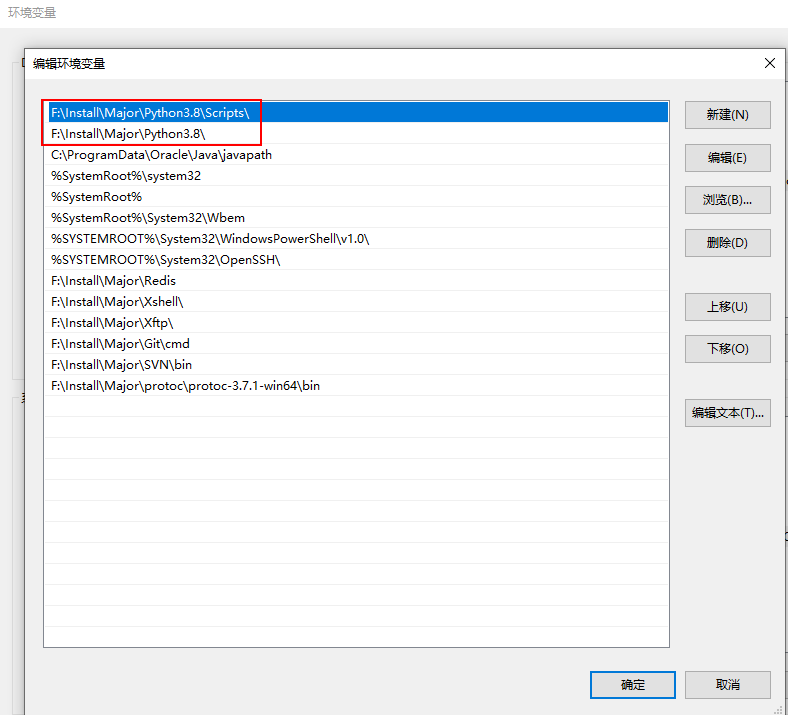
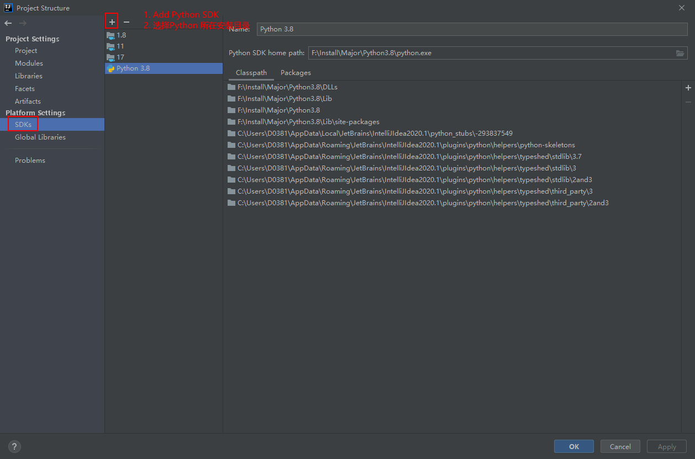
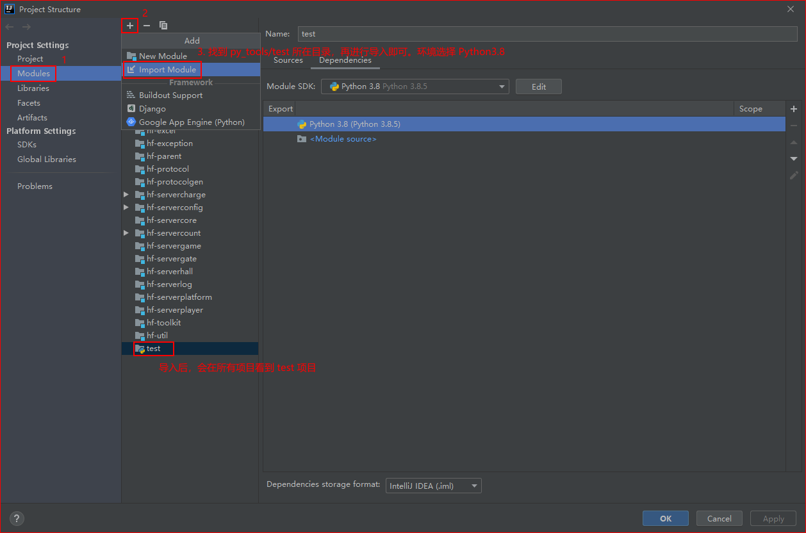
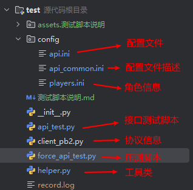
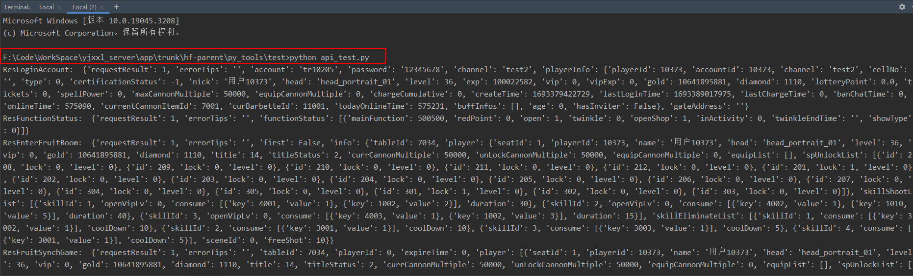
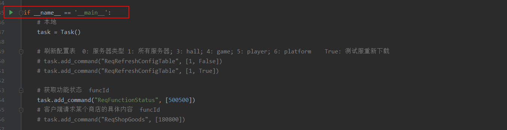

## Python 环境安装

1. **安装Python环境**(不低于3.8)

   Python安装包所在路径：`https://192.168.1.200/svn/baloot/tools/python-3.8.5.exe`

   傻瓜式安装。

2. 安装后检查环境变量是否配置好，若无，则手动配置一下

   

3. **IDEA 集成 Python 环境**

   

4. **IDEA 导入项目**

   

5. **安装依赖**：

   - `websockets`
   - `requests`
   - `protobuf`

   **命令**：eg：`pip install websockets`


## Test 脚本

### 脚本介绍



1. `api.ini`  脚本配置文件。具体配置信息查看 `api_common.ini` 文件注释。

2. `players.ini`  玩家账号信息。自动注册，无需手动输入！

   ```ini
   # xuhai环境
   [xuhai]
   
   # liuzhen环境
   [liuzhen]
   liuzhen_1 = {"isUsed": 0, "deviceId": "liuzhen_1", "playerId": 10000006, "nick": "\u0636\u064a\u064110000006"}
   
   # dev环境
   [dev]
   
   # test环境
   [test]
   ```

3. `api_test.py`  接口测试脚本，打印结果返回为 **json 对象**。调用 `task.add_command("protocalName", [param1, param2, ...])`

   **函数介绍**：

   - `add_command(protocol_name: str, params: list, callback=None)`：异步发送消息，请求接口

   - `send_msg_and_receive(self, protocol_name: str, params: list)`：同步发送消息，请求接口，阻塞获得请求接口返回内容。

   - `buy_goods(goodsId: int)`：购买礼包

     

   **函数参数介绍**：

   - **protocalName**：接口协议名称。如：`ReqGiveMeItems  ReqFunctionStatus  ReqRefreshConfigTable`

   - **param**：接口所需参数:，传参有两种方式。

     - **{}**：, 传入json字符串，根据协议中的 `type` 与 `field` 进行对参数拼接。适用于传入比较复杂的参数类型。

       若果参数类型是枚举，则传入指定**枚举的值名称**即可！

       eg：

       ```python
       # 执行gn命令，增加道具
       self.add_command("CWExecuteGmCmdMessage", {"key":"道具", "args": ["1000,2000"]})
       # 请求baloot游戏房间信息。 mode为枚举类型
       task.add_command("CGBalootRoomInfosMessage", {"mode":"COMMON"})
       ```

   - **callback(client: Client, responseResult: ResponseResult)**：回调函数

     eg：在压测脚本中，监听消息，回调

     ```python
     # 定义同步游戏数据(GCSyncGameMessage) 回调
     def sync_game_callback(client: Client, responseResult: ResponseResult):
         if responseResult.errorCodeValue == 0:
             resMessage = responseResult.resMessage
             # 同步玩家座位号
             for gamePlayerBean in resMessage.baseInfo.player:
                 if gamePlayerBean.seatInfo.playerId == client.player.playerId:
                     balootGameOb.seatId = gamePlayerBean.seatInfo.seatId
                     print(f"设置玩家座位号 playerId: {gamePlayerBean.seatInfo.playerId} seatId: {balootGameOb.seatId}")
     
     
             # 协议信息
             # 同步seq
             balootGameOb.seq = resMessage.balootInfo.seq
             balootGameOb.balootInfo = resMessage.balootInfo
             balootGameOb.baseInfo = resMessage.baseInfo
             # print("sync_game_callback update seq: ", balootGameOb.seq)
     
             execute_command()
         else:
             print("同步游戏失败~ Errorcode: ", responseResult.errorCodeValue)
     ```

     

   **调用示例**

   ```python
   if __name__ == '__main__':
     helper.handle_dirty_players_config_data()
     task = Task()
     task.start()
   
     # task.add_command("CWGetPlayerInfoMessage", {})
     # 增加道具
     # task.add_command("CWExecuteGmCmdMessage", {"key":"道具", "args": ["1000,2000"]})
   
     # 请求baloot游戏房间信息
     # task.add_command("CGBalootRoomInfosMessage", {"mode":"COMMON"})
   
   
     # 请求玩家个人信息  id: 玩家id
     # task.add_command("CWGetPlayerInfoMessage", {})
     # 请求获取自己赠送礼物记录列表  position: 槽位(从0开始)   count: 总数
     # task.add_command("CWGetPlayerSendGiftListMessage", {"position": 2, "count": 200})
     # 请求获取通用表情列表
     # task.add_command("CWGetCommonEmoteListMessage", {})
   
     # 请求标记完成新手引导
     # task.add_command("CWMarkFinishGuideMessage", {})
     # 请求获取新手累计签到信息
     # task.add_command("CWGetSignInfoMessage", {})
     # 请求获取新手累计签到信息
     # task.add_command("CWGetSignRewardMessage", {"day":1})
   
     # 请求获取游戏公告列表消息
     # task.add_command("CWGetNoticeListMessage", {})
   
     # 请求消除功能红点消息
     # task.add_command("CWClearFuncRedPointMessage", {"functionId":202, "arg0":1})
   
     # 购买钻石
     # task.buy_goods(101)
   ```

   

4. `force_api_test.py`  压测脚本。

   

### 脚本运行

1. 方式1：命令运行。切换到脚本所在目录，打开cmd窗口，输入命令。eg：`python api_test.py`

   

2. 方式2：idea配置好环境跟导入项目后，**IDEA 打开脚本文件，通过 main 方法执行脚本**。

   